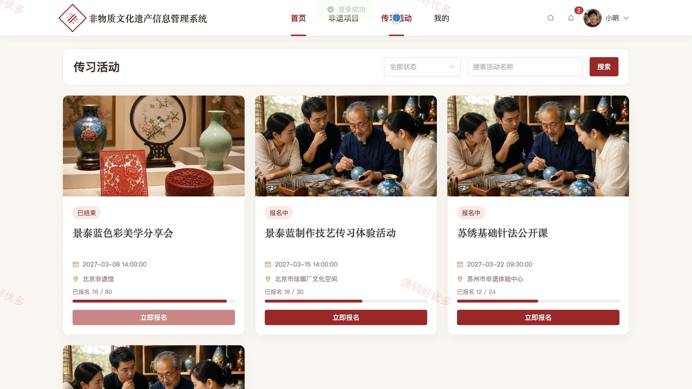
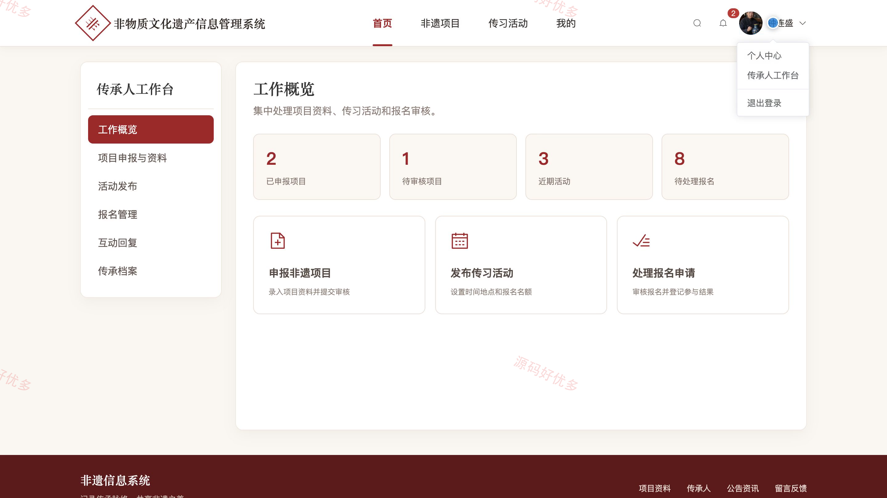
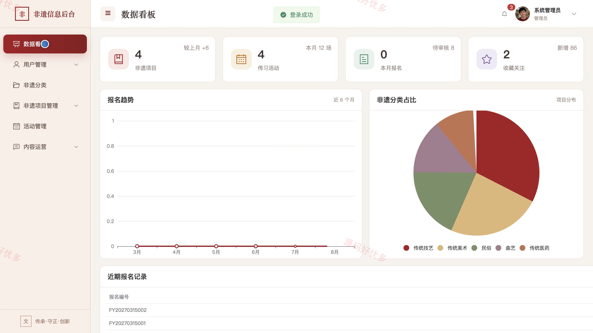
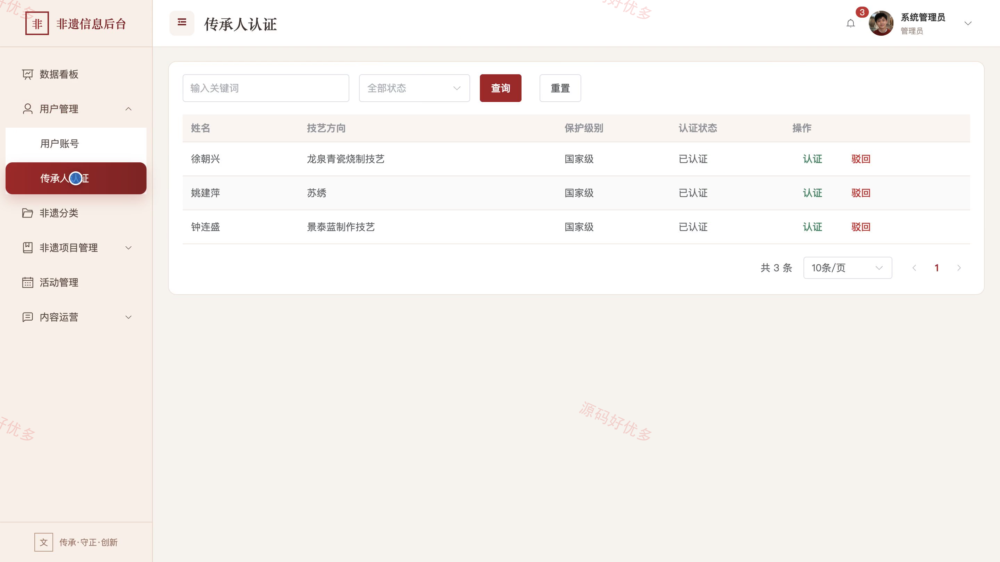
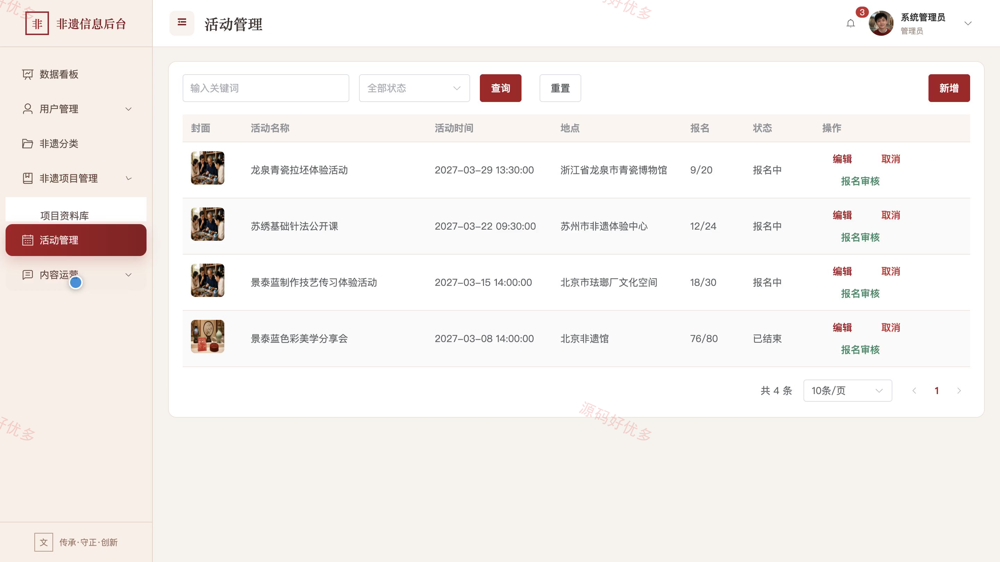

# bs041A
bs041A非物质文化遗产信息管理系统
## 源码问题查看主页咨询

### 一、关键词
非物质文化遗产、非遗项目申报、传承人档案、传习活动、非遗保护

### 二、作品包含
源码+数据库+全套环境和工具资源+本地部署教程

### 三、项目技术
前端技术： Html、Css、Js、Vue3.4、Element-Plus
后端技术：Java、SpringBoot3.2.0、MyBatis-Plus

### 四、运行环境（以下版本亲测，其他版本兼容性请自行测试）
开发工具：IDEA/eclipse + VSCODE

数据库：MySQL5.7+（共11张表）

数据库管理工具：Navicat10以上版本

环境配置软件： JDK17 + Maven

前端Nodejs：20.19.5

浏览器：谷歌浏览器

### 五、项目介绍
项目编号：bs041A

非物质文化遗产信息管理系统面向非遗项目展示、传承人服务与文化传播场景，为普通用户提供项目浏览、活动报名、收藏和反馈入口，为非遗传承人提供项目申报、活动发布与报名管理工作台，并支持管理员统一维护用户、传承人认证、项目审核、分类、活动、公告和留言数据。

角色：普通用户、非遗传承人、管理员

普通用户功能：登录注册与个人资料维护、非遗项目浏览与收藏、传承人档案查看、传习活动查看与报名、公告资讯查看、留言反馈。

非遗传承人功能：登录与个人资料维护、工作概览、项目申报与资料维护、传习活动发布、活动报名管理、互动回复、传承档案维护。

管理员功能：数据看板、用户账号管理、传承人认证、非遗分类管理、项目资料与审核管理、传习活动管理、公告管理、留言管理。

### 六、运行截图

